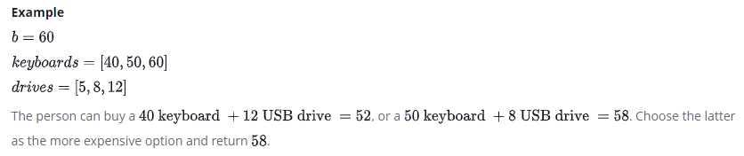

# Electronics-Shop

## Intro
A person wants to determine the most expensive computer keyboard and USB drive that can be purchased with a give budget. Given price lists for keyboards and USB drives and a budget, find the cost to buy them. If it is not possible to buy both items, return . **-1**



## Function Description
Complete the getMoneySpent function in the editor below.

### getMoneySpent has the following parameter(s):

* int b: the budget
* int keyboards[n]: the keyboard prices
* int drives[m]: the drive prices


### Returns
* int: the maximum that can be spent, or **-1** if it is not possible to buy both items

## Sample Input 0
```
10
[3, 1]
[5, 2, 8]
```
## Sample Output 0
```
9
```
## Explanation 0

Buy the **2nd** keyboard and the **3rd** USB drive for a total cost of **1+8=9**.

## Sample Input 1
```
5
[4]
[5]
```
## Sample Output 1
```
-1
```
## Explanation 1

There is no way to buy one keyboard and one USB drive because **4+5=9>5**, so return **-1**.